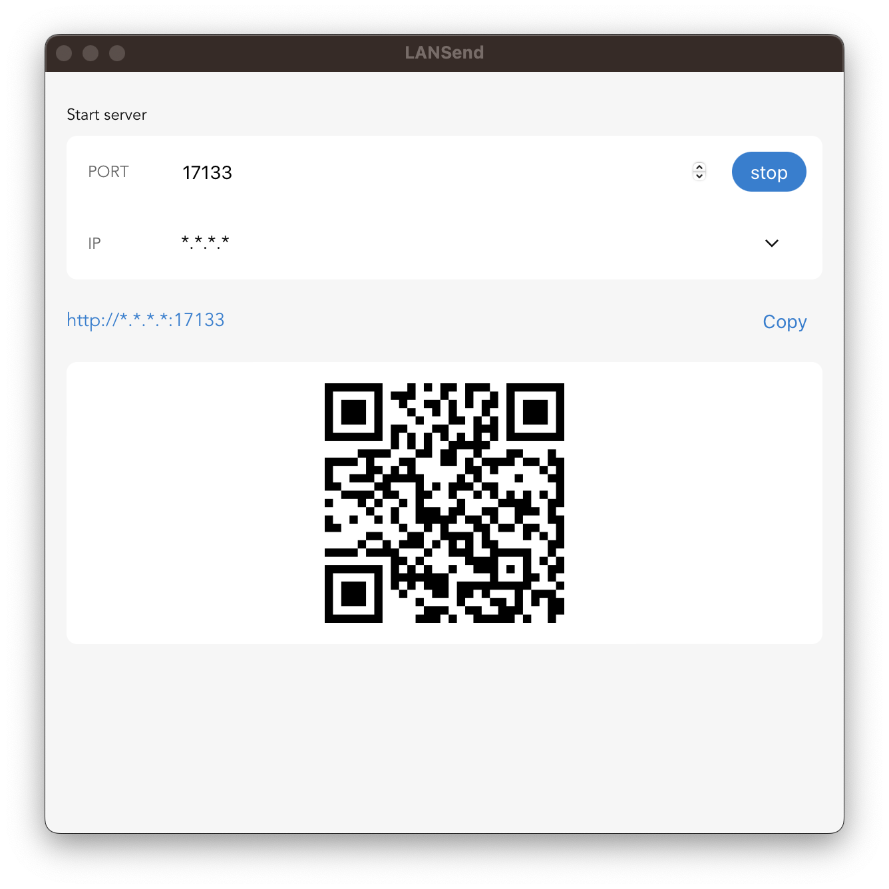
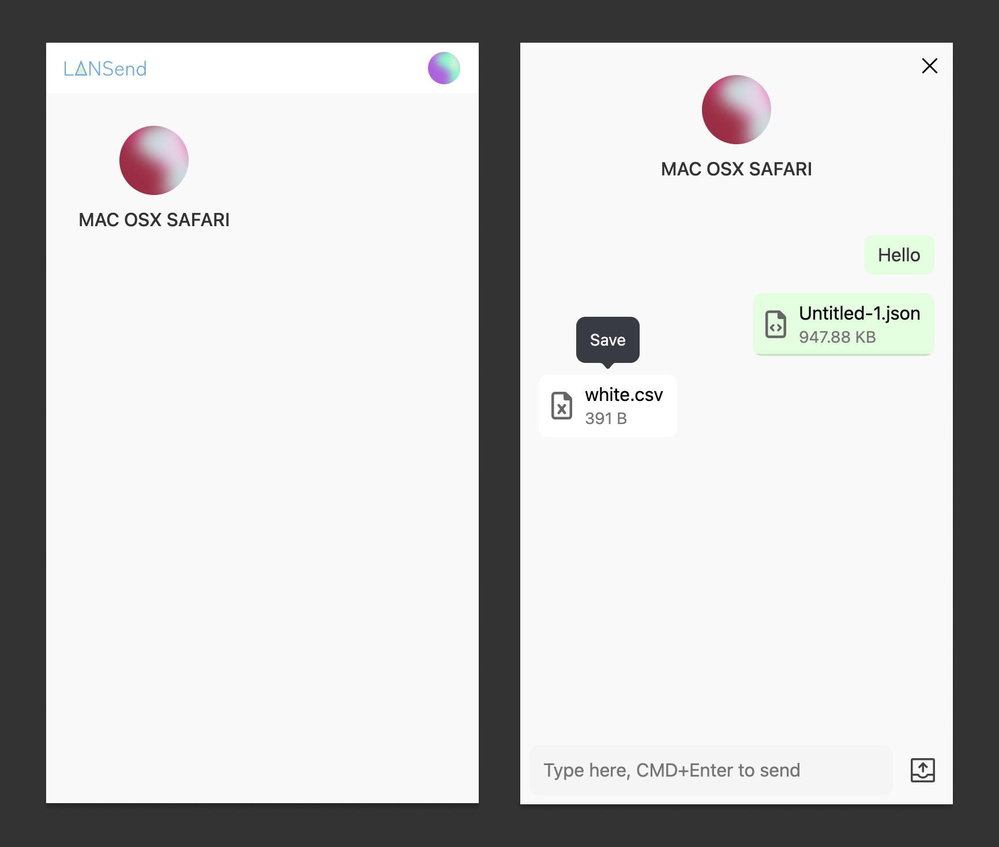

# LANSend

LANSend is a cross-platform app that enables the transfer of messages and files between devices within the same local network via a web browser.

It consists of two components:

1. The server program in the form of a command-line tool or a desktop app.
2. A web-based chat client, which can be accessed once the server is started.

## Usage

### Install the launcher

Install command-line tool or a desktop app from releases page.

### Start chat server

#### For command-line

run:

```
lansend -p 10086
```

#### For GUI app

Open the app then click _start_.


### Visit web app

Open http://YOUR_IP:PORT in browser.


